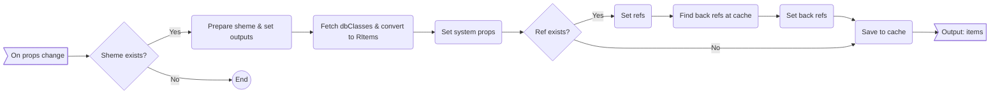

# UseData
## Назначение
*  Получает и выдает данные в Noodl.
*  Слушает обновления данных в БД.
*  Выстравивает связи между классами.
*  Полнотекстовый поиск.
## Процессы

```mermaid
flowchart LR
    a>On props change] --> a1{Sheme exists?}
       a1 -->|Yes| ay1(Prepare sheme & set outputs) --> ay2(Fetch dbClasses & convert to RItems) --> ay3(Set system props) --> ay4{Ref exists?}
            ay4 -->|Yes| ay4y1(Set refs) --> ay4y2(Find back refs at cache) --> ay4y3(Set back refs) --> a2
            ay4 -->|No| a2
       a1 -->|No| an1((End))
       a2(Save to cache) --> a3>Output: items]
    
```