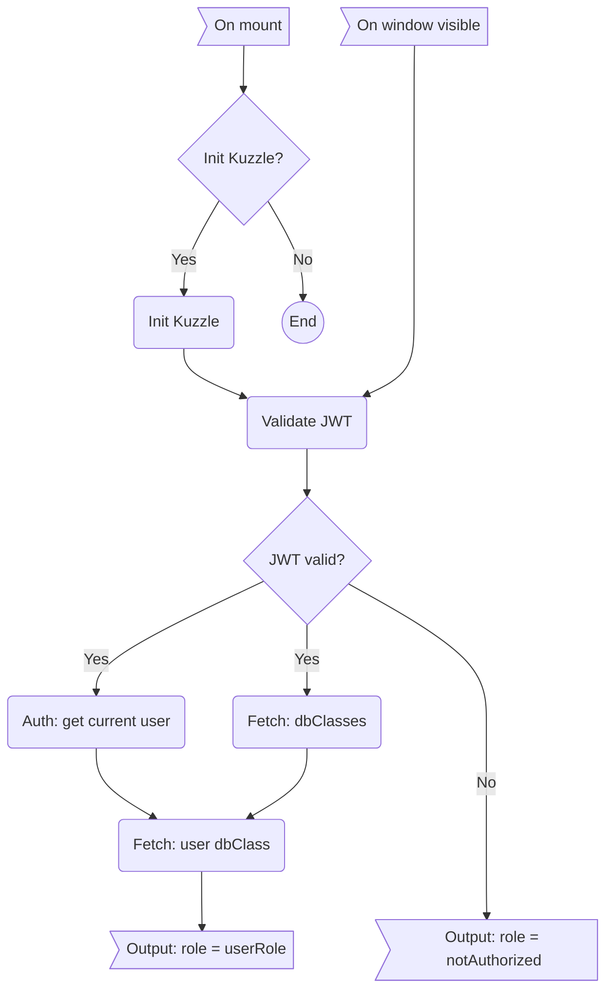

# App
## Назначение
*  Контекст. Задает параметры для всех дочерних нод:
   *  Mantine - тема, настройки дат, сообщения и другое
   *  Query - параметры запросов.
   *  Rolder - параметры проекта, дефолты, классы БД.
*  Поддержка сессии пользователя.
## Процессы
