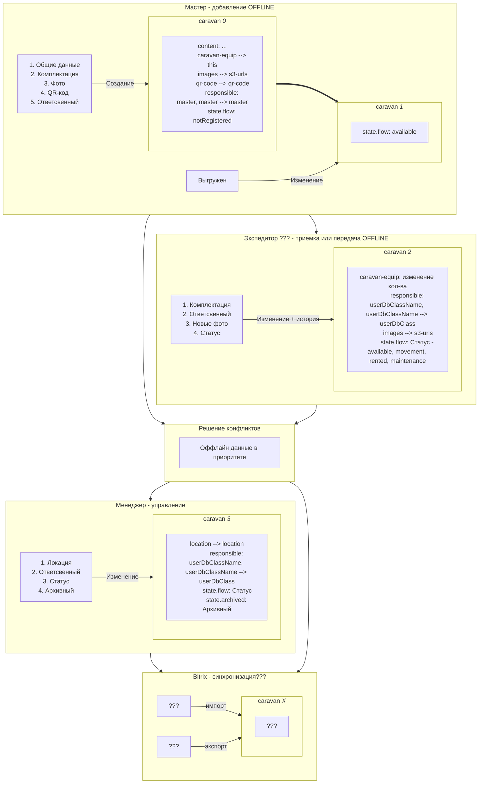

# Компонента управления сессией пользователя. Что умеет

- Авторизует пользователя.
- Поддерживает сессию, обновляя токен.
- Поддерживает сессию, не обновляя токен, но проевряя его сразу по входу в сеть.
- Хранит сессию на диске для ее восстановления при повторных запусках. Для каждого приложения, версии, среды и ссылки своя хранилка.
- Шарит сессию между вкладками или окнами одного браузера. В том числе реактивно - вошел на одной вкладке, залогинелось и в другой.

## Изменение состояния вагон-дома v0.1.0

