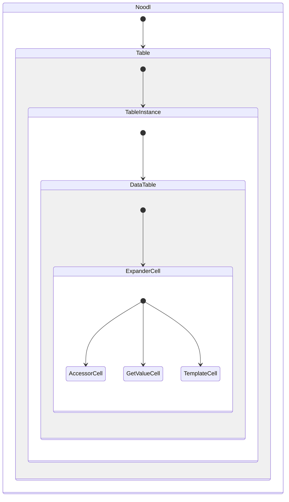
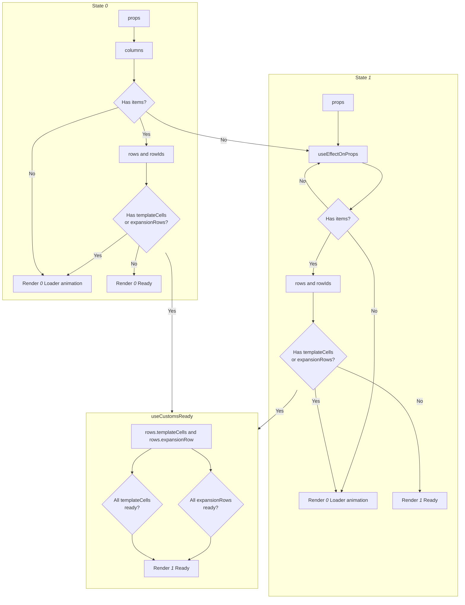

# Не абы че, а целая модульная таблица :)

Здесь описание общих приницпов. В каждом файле более подробно.

Эта версия максимальна близка к нативному использованию библиотеки. Это так, потому что, и сама библиотека теперь покрывает наши нужды, и хватает опыта не извращаться.

## Требования

Требования, на которые ориентироваться при разарботке.

- Строгая типизация. Помогает не наломать дров и подсказывает разработчику об ошибках в схеме колонок.
- Минимальный рендер:
  - Ячейки рендерят содержание 1 раз.
  - Добавление items вызывает рендер только их. При удалении существующие строки не рендерятся.

## Решения

- **Таблица** выделена в отдельную компоненту `TableInstance`. Управление состояниями осуществляется в `Table`, а `TableInstance` принимает это состояние и некоторые параметры. Так достигается контроль ренедринга при смене значения портов. Все состояния у нас могут меняться извне (`epxansion`, `selection` и др.), поэтому такое решение. Можно еще так сказать - используется принцип белого листа, таблица рендерится только когда ей прямо говорят об этом. В итоге получилось так, что управление таблицей идет из `Table` одним большим стейтом.
- **Модели**. Модель - это схема того или иного набора данных и методы работы с ней. Строго типизирована через `Zod`. Он же позвоялет удобнее управлять дефолтами. Здесь тоже правило белого листа, все что не задано в модели, не попадает в таблицу. Это позволяет уверенно разрезать большое количество прилетающих данных с портов на управляемые сущности.
- **Реактивность**. Было испробовано несколько способов использовать точечную реактивность: `React.memo` с функцией сравнивающей props, крутая и сложная библиотека `MobX`, простой `Valtio`, ну и куча промежуточных вариантов. В результате остановился на `Zustand`. Тут оставлю для будущего себя и других приницпы того как делается точечный рендер или **точечная реактивность**:
  - Если рендер начался в компоненте он продолжается по всей дочерней иерархии. Не важно, изменились ли props у дочерних компонент. Способ остановки рендера - обернуть компоненту в `React.memo`. В нашем случае еще строже, `TableInstance` и ячейки вообще не имеет props: `export default memo((нету props) => {...`. Такой способ создает правило - рендерим только тогда, когда об этом **сказано прямо**.
  - Нельзя просто так передать вложенный объект в данных и иметь точеную реактивность. Здесь сломал массу копей. Какой бы способ не был использован, какая бы не была библиотека, это требует отдельного внимания. Решение найдено такое:
    - С **Accessor-ячейкой** все просто. У нас есть статичный `accessor`, по нему легко сделать точечную реактивность. Это работает со всеми перебранными вариантами. Отсюда вывод - главное как то знать точный селектор из хранилища состояния таблицы.
    - С **GetValue-ячейкой** сложнее. Разработчик в функции хочет видеть весь item, а может и все items. Если просто передавать в ячейке item, то при любом изменении будет рендер, а нам надо чтобы только при изменении запрашиваемых данных. Решение такое. Даем разработчику контроль над селектором и одновременно требуем это от него. Т.е. разработчик должен подать accessors, по которым срабатывает реактивность, за что получит item и items только когда это действительно нужно.
    - С **Template-ячейкой** еще сложнее. Noodl позволяет создавать ноды на лету, но делает это асинхронно. Соответсвнно, нужно сначала создать ячейку и одновременно сделать ее реактивной на изменения данных. Здесь решение такое. При создании ячейки в нее подается (создается/заменяется) Noodl-объект. Далее, рендер никогда не запускается, но обновляется Noodl-объект, который уже на уровне Noodl и управляет реактинвостью. Тут уже ответсвенность разработчика понимать устройство реактивности в Noodl.

## Схемы

### Структура рендера

ExpanderCell оборачивает ячейку, когда включен в сехеме колонки.

### Сценарии

Это одновременно основные сценарии поведения таблицы и схемы описывающие процессы.

#### Первичная установка колонок и строк

- items есть сразу и нет кастомизаций (кастомные ячейки, расширяемые строки).
- items есть сразу и есть кастомизации.
- items нет сразу и нет кастомизаций.
- items нет сразу и есть кастомизаций.

