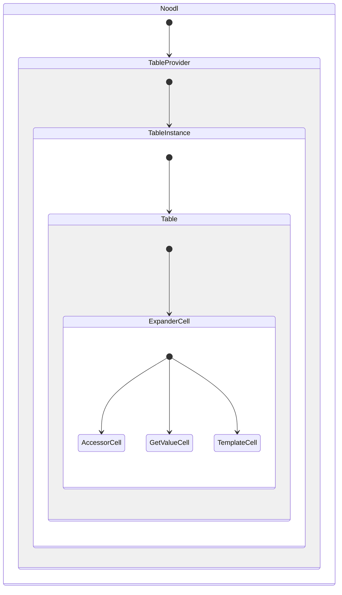
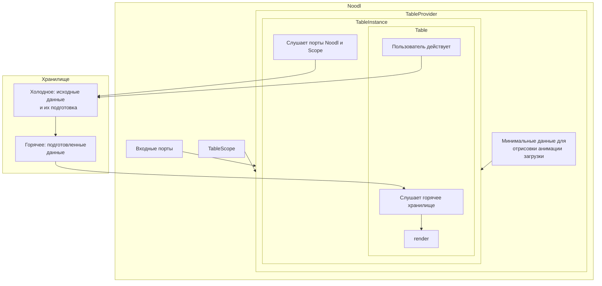

# Не абы че, а целая модульная таблица :)

Здесь описание общих приницпов. В каждом файле более подробно.

Эта версия максимальна близка к нативному использованию библиотеки. Это так, потому что, и сама библиотека теперь покрывает наши нужды, и хватает опыта не извращаться.

## Требования

Требования, на которые ориентироваться при разарботке.

- Строгая типизация. Помогает не наломать дров и подсказывает разработчику об ошибках в схеме колонок.
- Минимальный рендер:
  - Ячейки рендерят содержание 1 раз.
  - Добавление items вызывает рендер только их. При удалении существующие строки не рендерятся.
  - Изменение состояний вызывает 1 рендер таблицы.

## Решения

- **Хранилище**. Используется принцип холодного и горячего хранилища. Схема ниже. Все изменения и логика их обработки в холодном хранилище. Горячее хранилище не имеет никакой логики, только хранит состояние. Таблица подписана на горячее хранилище и рендерится при его изменении. При этом, в холодном хранилище данные хроняться в формате удобном для разработки, а в горячем в формате макимально близком к требованиям библиоткеи. Чтобы это работало нужно соблюдать 3 правила:
  1. Подготавливать все данные только в холодном хранилище. Это нужно, чтобы вообще не париться что там с рендерингом, легче работать с асинхонностью и другие плюшки.
  2. В горячем хранилище использовать store.set, т.е. менять состояние разом. Это сводит к минимуму лишние рендеры.
  3. Чтобы горячая хранилка дожидалась асинхронных операций в actions, обязателнь нужно использовать store.set Найдено с умным видом методом научного тыка.
- **Таблица** выделена в отдельную компоненту `Table`. Управление состояниями осуществляется в `TableInstance`, а `Table` принимает это состояние и некоторые параметры. Так достигается контроль ренедринга при смене значения портов. Все состояния у нас могут меняться извне (`epxansion`, `selection` и др.), поэтому такое решение. Можно еще так сказать - используется принцип белого листа, таблица рендерится только когда ей прямо говорят об этом. В итоге получилось так, что управление таблицей идет из `TableInstance` одним большим стейтом.
- **Модели**. Модель - это схема того или иного набора данных и методы работы с ней. Строго типизирована через `Zod`. Он же позвоялет удобнее управлять дефолтами. Здесь тоже правило белого листа, все что не задано в модели, не попадает в таблицу. Это позволяет уверенно разрезать большое количество прилетающих данных с портов на управляемые сущности.
- **Реактивность**. Было испробовано несколько способов использовать точечную реактивность: `React.memo` с функцией сравнивающей props, крутая и сложная библиотека `MobX`, простой `Valtio`, ну и куча промежуточных вариантов. В результате остановился на `Zustand` и его обертке `@davstack/store`. Тут оставлю для будущего себя и других приницпы того как делается точечный рендер или **точечная реактивность**:
  - Если рендер начался в компоненте он продолжается по всей дочерней иерархии. Не важно, изменились ли props у дочерних компонент. Способ остановки рендера - обернуть компоненту в `React.memo`. В нашем случае еще строже, `Table` и ячейки вообще не имеет props: `export default memo((нету props) => {...`. Такой способ создает правило - рендерим только тогда, когда об этом **сказано прямо**.
  - Нельзя просто так передать вложенный объект в данных и иметь точеную реактивность. Здесь сломал массу копей. Какой бы способ не был использован, какая бы не была библиотека, это требует отдельного внимания. Решение найдено такое:
    - С **Accessor-ячейкой** все просто. У нас есть статичный `accessor`, по нему легко сделать точечную реактивность. Это работает со всеми перебранными вариантами. Отсюда вывод - главное как то знать точный селектор из хранилища состояния таблицы.
    - С **GetValue-ячейкой** сложнее. Разработчик в функции хочет видеть весь item, а может и все items. Если просто передавать в ячейке item, то при любом изменении будет рендер, а нам надо чтобы только при изменении запрашиваемых данных. Решение такое. `@davstack/store` позволяет подписаться на выполнение функции, т.е. если функция возвращает новое значение, подписка срабатывает, иначе нет. Есть еще более точный вариант - просить разработчика указывать пути к данным в item, которые ему нужны. Тогда можно на них подписаться и выполнять функцию только при смене данных. Но это оказалось сложно. Сложно отследить смену ключей, не зациклиться и т.д.
    - С **Template-ячейкой** еще сложнее. Noodl позволяет создавать ноды на лету, но делает это асинхронно. Соответсвнно, нужно сначала создать ячейку и одновременно сделать ее реактивной на изменения данных. Здесь решение такое. При создании ячейки в нее подается (создается/заменяется) Noodl-объект. Далее, рендер никогда не запускается, но обновляется Noodl-объект, который уже на уровне Noodl и управляет реактинвостью. Тут уже ответсвенность разработчика понимать устройство реактивности в Noodl.

## Схемы

### Структура рендера

ExpanderCell оборачивает ячейку, когда включен в сехеме колонки.

### Управление состоянием.

Здесь главное, что нет связи внутри таблицы. Все происходит в холодном, горячем хранилищах и тем как обнолвяется горячее.
